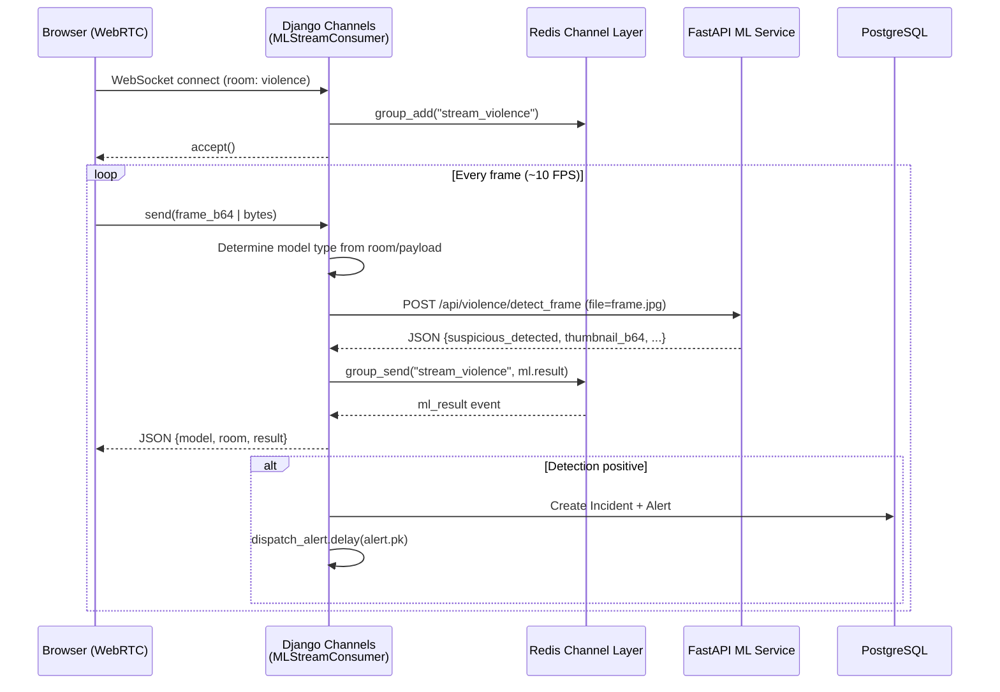
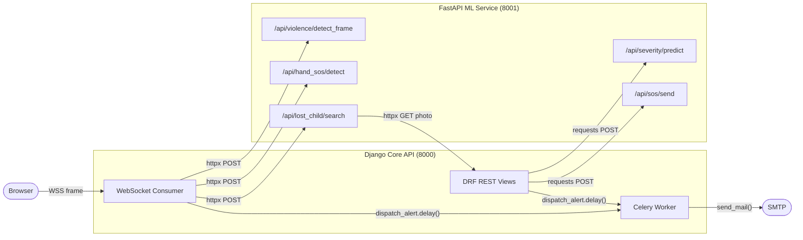
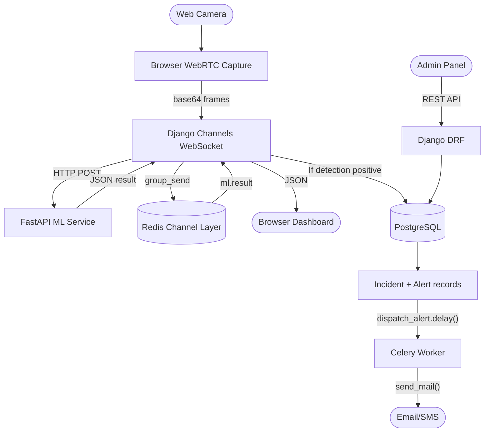

# CareVault — Architecture & Migration Document

> **Purpose:** Comprehensive technical reference for knowledge transfer.
> Covers the **current implemented architecture** (Django + FastAPI, as-built)
> and the original migration rationale from the legacy Flask monolith.

---

## 1. Project Overview

CareVault is a safety-and-surveillance platform consisting of four AI modules:

| Module | ML Technique | Purpose |
|---|---|---|
| **HandSOS** | MediaPipe Hands + TFLite keypoint classifier | Detects a "Help" hand gesture via webcam |
| **Violence Detection** | YOLO11s-pose + XGBoost classifier | Detects suspicious / violent activity in video |
| **Lost Child Search** | Haar cascade + LBPH face recognizer | Matches a live camera frame against a missing-person reference photo |
| **Incident Severity** | TF-IDF + scikit-learn classifier | Predicts severity level from a text description |

---

## 2. Repository Structure

```
carevault-tensortitans/
├── docker-compose.yml         # Infrastructure (PostgreSQL + Redis)
├── migration_doc.md           # This file
├── README.md
│
├── core_api/                  # Django 6.0 — backend + web UI (port 8000)
│   ├── pyproject.toml         # Poetry deps — Django, DRF, Channels, etc.
│   ├── manage.py
│   ├── carevault_core/        # Django project settings
│   │   ├── settings.py
│   │   ├── urls.py            # Root URL dispatcher
│   │   ├── asgi.py            # Daphne ASGI + Channels WebSocket routing
│   │   ├── wsgi.py
│   │   └── celery.py          # Celery application
│   ├── api/                   # DRF REST API app
│   │   ├── models/            # Organisation, Incident, Alert, etc.
│   │   ├── serializers/       # DRF serializers
│   │   ├── views/             # REST endpoint views
│   │   ├── websockets/        # Django Channels consumers + routing
│   │   ├── tasks.py           # Celery task(s)
│   │   └── urls.py            # /api/ URL patterns
│   ├── users/                 # Custom user model + auth views
│   │   ├── models.py          # CustomUser (AbstractUser)
│   │   ├── views.py           # RegisterView, ProfileView
│   │   └── urls.py            # /users/ (JWT token routes)
│   └── web/                   # Server-rendered web UI (TailwindCSS)
│       ├── views/             # View package (pages, auth, incidents, org, dashboards)
│       ├── templates/web/     # Templates grouped by feature
│       ├── forms.py           # Django forms
│       ├── decorators.py      # @org_admin_required
│       └── urls.py            # / (root namespace)
│
└── ml_service/                # FastAPI — ML inference service (port 8001)
    ├── pyproject.toml         # Poetry deps — FastAPI, YOLO, mediapipe, etc.
    ├── main.py                # FastAPI app + router registration
    ├── schemas.py             # Pydantic request/response models
    ├── routers/               # One router per ML module
    │   ├── violence.py        # YOLO11s-pose + XGBoost
    │   ├── hand_sos.py        # MediaPipe Hands + TFLite
    │   ├── lost_child.py      # Haar + LBPH face recognition
    │   ├── severity.py        # TF-IDF + sklearn
    │   └── sos.py             # Alert payload formatting
    └── models/                # Trained model files
        ├── yolo11s-pose.pt
        ├── trained_model.json         # XGBoost violence model
        ├── hand_landmarker.task
        ├── incident_severity_model.pkl
        ├── tfidf_vectorizer.pkl
        └── keypoint_classifier/       # TFLite + label CSV
```

---

## 3. Infrastructure

### 3.1 Docker Compose (Development)

Only infrastructure services run in Docker; the application services run natively:

| Service | Image | Port | Purpose |
|---|---|---|---|
| `db` | `postgres:15-alpine` | `5432` | Primary relational database |
| `redis` | `redis:alpine` | `6379` | Channel layer + Celery broker |

### 3.2 Dependency Management

Both services use **Poetry** with a `pyproject.toml` and `poetry.lock` for deterministic builds.

| Service | Python | Key Packages |
|---|---|---|
| **core_api** | ≥ 3.12 | Django 6, DRF, Channels, Daphne, Simple JWT, Celery, Pillow, psycopg2, django-tailwind |
| **ml_service** | ≥ 3.12 | FastAPI, Uvicorn, OpenCV-headless, Ultralytics (YOLO), XGBoost, MediaPipe, scikit-learn, pandas |

---

## 4. Django Core API — Detailed Architecture

### 4.1 Django Apps

| App | Responsibility |
|---|---|
| `carevault_core` | Project settings, root URLs, ASGI/WSGI config, Celery setup |
| `api` | REST endpoints, database models, serializers, WebSocket consumers, Celery tasks |
| `users` | Custom user model, JWT token endpoints, registration/profile views |
| `web` | Server-rendered UI (HTML + TailwindCSS), Django forms, template-based views |
| `theme` | TailwindCSS build configuration (django-tailwind) |

### 4.2 Settings Highlights (`carevault_core/settings.py`)

```
ASGI_APPLICATION  = 'carevault_core.asgi.application'    # Daphne serves both HTTP + WS
AUTH_USER_MODEL   = 'users.CustomUser'
ML_SERVICE_URL    = env('ML_SERVICE_URL', 'http://localhost:8001')
CELERY_BROKER_URL = env('REDIS_URL', 'redis://localhost:6379/0')
CELERY_RESULT_BACKEND = 'django-db'   # django_celery_results
```

**Authentication stack:**
- **Web UI:** Django session-based auth (login/logout views)
- **REST API:** JWT via `djangorestframework-simplejwt` (60 min access / 1 day refresh)

### 4.3 Data Models


#### 3.2.2 System Diagram
The System Diagram illustrates the physical and logical deployment of containers, highlighting how they communicate over the internal Docker network.



**Key consumer behaviours:**
- Accepts both **binary** frames and **JSON** payloads with `frame_b64`
- Routes to the correct ML endpoint based on room name or payload `type` field
- Uses `httpx.AsyncClient` for non-blocking HTTP calls to FastAPI
- Auto-creates `Incident` + `Alert` records for positive detections
- Dispatches email alerts asynchronously via Celery

### 4.6 Celery Background Tasks

| Task | Trigger | Behaviour |
|---|---|---|
| `dispatch_alert(alert_id)` | WebSocket consumer / SOS views | Sends email via `django.core.mail.send_mail`, updates Alert status to `sent`/`failed`, marks `Incident.is_alerted=True`. Retries up to 3 times with 30s delay. |

**Celery config:** Uses Redis as broker, `django_celery_results` as result backend.

### 4.7 Web UI (Server-Rendered)

The `web` app serves HTML pages using Django templates + TailwindCSS.

**Views package** (`web/views/`):

| Module | Views | Description |
|---|---|---|
| `pages.py` | `landing_view`, `home_view`, `dashboard_view`, `analysis_view` | Core navigation pages |
| `auth.py` | `login_view`, `logout_view`, `register_view` | Session-based authentication |
| `incidents.py` | `incidents_view`, `report_incident_view`, `missing_persons_view`, `report_missing_view` | Incident/missing person CRUD |
| `org.py` | `org_panel_view`, `add_employee_view`, `camera_manage_view`, `camera_delete_view` | Organisation management (admin-only via `@org_admin_required`) |
| `dashboards.py` | `VigilanceDashboardView`, `ViolenceDashboardView`, `HandSOSDashboardView`, `LostChildDashboardView` | ML dashboard pages (CBVs with `LoginRequiredMixin`) |

**Template structure:**

```
templates/web/
├── base.html             # Base layout (nav, footer, TailwindCSS)
├── auth/                 # login.html, register.html
├── pages/                # landing, home, dashboard, analysis
├── incidents/            # incidents list, report_incident, missing_persons, report_missing
├── org/                  # org_panel, add_employee
├── cameras/              # manage.html
└── dashboards/           # vigilance, dashboard_violence, dashboard_handsos, dashboard_lostchild
```

All templates extend `web/base.html`. The ML dashboards include JavaScript for WebSocket-driven real-time video feeds and detection overlays.

### 4.8 Organisation & Token-Based Registration

1. A **super-admin** creates an `OrgRegistrationToken` via Django Admin (with optional org name hint, 3-day expiry).
2. The registering admin visits `/register/?token=<uuid>` — form pre-fills org name.
3. On submit, an atomic transaction creates: `CustomUser` (role=admin) → `Organisation` → links user to org → marks token as used.
4. The new admin can then add employees via the Org Panel.

---

## 5. FastAPI ML Service — Detailed Architecture

### 5.1 Application Setup (`main.py`)

```python
app = FastAPI(title="CareVault ML Service", version="1.0.0")

app.include_router(violence.router,   prefix="/api/violence")
app.include_router(hand_sos.router,   prefix="/api/hand_sos")
app.include_router(severity.router,   prefix="/api/severity")
app.include_router(sos.router,        prefix="/api/sos")
app.include_router(lost_child.router, prefix="/api/lost_child")
```

Runs on **Uvicorn** at port `8001` with auto-reload in development.

### 5.2 Pydantic Schemas (`schemas.py`)

| Schema | Fields | Used By |
|---|---|---|
| `SeverityRequest` | `description` | `/api/severity/predict` input |
| `SeverityResponse` | `severity`, `description` | `/api/severity/predict` output |
| `ViolenceResponse` | `suspicious_detected`, `frame_count`, `suspicious_frame_count`, `thumbnail_b64`, `message` | Violence endpoints output |
| `HandSOSResponse` | `gesture`, `hand_sign_id`, `sos_detected`, `hands_found`, `annotated_image_b64` | Hand SOS endpoint output |
| `SOSResponse` | `subject`, `recipients`, `body`, `image_filename` | SOS alert endpoints output |
| `LostChildResponse` | `status`, `message`, `matched`, `confidence`, `person_id`, `annotated_image_b64` | Lost child endpoint output |

### 5.3 ML Routers (Detailed)

#### 5.3.1 Violence Detection (`routers/violence.py`)

**Models:** `yolo11s-pose.pt` (YOLO pose estimation) + `trained_model.json` (XGBoost classifier)

| Endpoint | Input | Processing | Output |
|---|---|---|---|
| `POST /api/violence/detect` | Video file (.mp4/.avi) | Processes every 3rd frame → YOLO pose estimation → extract 51 keypoint features → XGBoost classify → track suspicious frame count | `ViolenceResponse` with thumbnail of most suspicious frame |
| `POST /api/violence/detect_frame` | Single JPEG/PNG frame | Single frame → YOLO → XGBoost | `ViolenceResponse` (frame_count=1) |

**Model loading:** Lazy-loaded on first request. YOLO loaded via `ultralytics.YOLO()`, XGBoost loaded via `xgboost.Booster()`.

**Pipeline:**
```
Frame → YOLO11s-pose (17 keypoints × 3 coords = 51 features)
      → XGBoost classifier → "suspicious" / "normal"
      → Annotated frame with bounding boxes + labels
```

#### 5.3.2 Hand SOS (`routers/hand_sos.py`)

**Models:** MediaPipe Hands + `keypoint_classifier.tflite` + `keypoint_classifier_label.csv`

| Endpoint | Input | Processing | Output |
|---|---|---|---|
| `POST /api/hand_sos/detect` | Image file | MediaPipe hand detection → extract 21 landmarks → normalize → TFLite classify → check if gesture == "Help" | `HandSOSResponse` |

**Pipeline:**
```
Image → MediaPipe Hands (21 landmarks per hand)
      → Normalize relative to wrist → Flatten to 42 features
      → TFLite keypoint classifier → gesture label
      → sos_detected = (gesture == "help")
```

Contains an inline `_KeyPointClassifier` class that wraps TFLite interpretation (tries `tflite_runtime`, falls back to `tensorflow.lite`).

#### 5.3.3 Lost Child Search (`routers/lost_child.py`)

**Models:** OpenCV Haar cascade (face detection) + LBPH face recognizer

| Endpoint | Input | Processing | Output |
|---|---|---|---|
| `POST /api/lost_child/search?person_id=N` | Live camera frame + optional person_id | Detect faces (Haar) → if person_id given, fetch reference photo from Django → LBPH train on reference → predict against detected faces | `LostChildResponse` |

**Cross-service communication:** Fetches reference photo from Django's `/api/incidents/missing-persons/<pk>/photo-bytes/` endpoint via `httpx`. Uses `DJANGO_BASE_URL` env var (default `http://localhost:8000`).

**Match threshold:** LBPH confidence < 80 = match found.

#### 5.3.4 Severity Prediction (`routers/severity.py`)

**Models:** `tfidf_vectorizer.pkl` + `incident_severity_model.pkl` (scikit-learn)

| Endpoint | Input | Processing | Output |
|---|---|---|---|
| `POST /api/severity/predict` | JSON `{description: "..."}` | TF-IDF vectorize → sklearn predict → severity label | `SeverityResponse` |

Models are loaded **eagerly** at import time (unlike other routers which use lazy loading).

#### 5.3.5 SOS Alert Formatting (`routers/sos.py`)

**No ML models** — pure payload validation and formatting.

| Endpoint | Input | Processing | Output |
|---|---|---|---|
| `POST /api/sos/send` | Form: `receiver_emails`, `message`, optional `image` | Validate emails, format subject/body | `SOSResponse` |
| `POST /api/sos/travel` | Form: vehicle details, location, etc. | Validate, format travel alert body | `SOSResponse` |

**Important:** Email delivery is **not** handled by this service. The response is passed back to Django, which creates an `Alert` record and dispatches via Celery.

### 5.4 Trained Model Files

| File | Size | Router | Description |
|---|---|---|---|
| `yolo11s-pose.pt` | ~20 MB | violence | YOLO11 small model for human pose estimation |
| `trained_model.json` | ~40 KB | violence | XGBoost classifier (suspicious vs normal activity) |
| `hand_landmarker.task` | ~7.8 MB | hand_sos | MediaPipe hand landmarker task file |
| `keypoint_classifier/keypoint_classifier.tflite` | — | hand_sos | TFLite model for gesture classification |
| `keypoint_classifier/keypoint_classifier_label.csv` | — | hand_sos | Gesture class labels |
| `incident_severity_model.pkl` | ~3.5 KB | severity | Scikit-learn severity classifier |
| `tfidf_vectorizer.pkl` | ~4.6 KB | severity | TF-IDF text vectorizer |

---

## 6. Inter-Service Communication



**Communication patterns:**
- **WebSocket → ML:** `httpx.AsyncClient` (async, non-blocking) for real-time streaming
- **REST → ML:** `requests` (sync) for one-off API proxies (`SeverityCheckView`, `SOSAlertView`, `TravelAlertView`)
- **ML → Django:** `httpx` (lost_child fetches reference photo from Django)
- **Alert dispatch:** Celery task via Redis broker

**ML Service discovery:** Configured via:
1. `MLServiceConfig` singleton model (editable in Django Admin)
2. `ML_SERVICE_URL` env var as fallback default

---

## 7. High-Level Data Flow



---

## 8. How to Run (Development)

### 8.1 Start Infrastructure
```bash
docker-compose up -d    # PostgreSQL + Redis
```

### 8.2 Start Django Core API
```bash
cd core_api
poetry install
poetry run python manage.py migrate
poetry run python manage.py runserver 0.0.0.0:8000
```

For WebSocket support (production-like):
```bash
poetry run daphne -p 8000 carevault_core.asgi:application
```

### 8.3 Start Celery Worker
```bash
cd core_api
poetry run celery -A carevault_core worker --loglevel=info
```

### 8.4 Start ML Service
```bash
cd ml_service
poetry install
poetry run uvicorn main:app --host 0.0.0.0 --port 8001 --reload
```

### 8.5 Verify
- Django health: `GET http://localhost:8000/api/health/`
- ML health: `GET http://localhost:8001/health`
- ML docs: `http://localhost:8001/docs` (Swagger)
- Django Admin: `http://localhost:8000/admin/`

---

## 9. Original Migration Rationale (From Flask Monolith)

### 9.1 Previous Architecture

Individual modules (HandSOS, ViolenceDetection) ran as standalone Flask apps:
- Direct `cv2.VideoCapture(0)` on the server (hardware-coupled)
- Synchronous ML inference in Flask request handlers
- MJPEG streaming via `multipart/x-mixed-replace`
- Blocking email alerts on the main thread
- No separation of concerns

### 9.2 Problems Solved by Migration

| Problem | Old (Flask) | New (Django + FastAPI) |
|---|---|---|
| Hardware coupling | Server needs physical camera | Client-side WebRTC capture |
| Blocking ops | Infinite loop in request handler | Async WebSocket + async httpx |
| Scalability | Single process, cannot scale | ML service scales independently |
| Streaming overhead | MJPEG (bandwidth heavy) | WebSocket + base64/binary frames |
| Separation of concerns | UI + DB + ML in one process | Dedicated services per domain |
| Alerting | Blocking SMTP on main thread | Celery background tasks + Redis |
| Dependency management | Flat `requirements.txt` | Poetry with lock files |

---

## 10. Environment Variables

| Variable | Default | Description |
|---|---|---|
| `DB_NAME` | `carevault` | PostgreSQL database name |
| `DB_USER` | `carevault_user` | PostgreSQL user |
| `DB_PASS` | `carevault_password` | PostgreSQL password |
| `DB_HOST` | `localhost` | PostgreSQL host |
| `DB_PORT` | `5432` | PostgreSQL port |
| `REDIS_URL` | `redis://localhost:6379/0` | Redis URL (Channels + Celery) |
| `ML_SERVICE_URL` | `http://localhost:8001` | FastAPI ML service base URL |
| `DEBUG` | `True` | Django debug mode |
| `EMAIL_BACKEND` | `console` | Email backend (`smtp.EmailBackend` for production) |
| `EMAIL_HOST` | `smtp.gmail.com` | SMTP host |
| `EMAIL_HOST_USER` | — | SMTP username |
| `EMAIL_HOST_PASSWORD` | — | SMTP password |
| `DEFAULT_ALERT_RECIPIENTS` | — | Comma-separated fallback alert emails |
| `DJANGO_BASE_URL` | `http://localhost:8000` | Used by ML service to fetch photos from Django |
