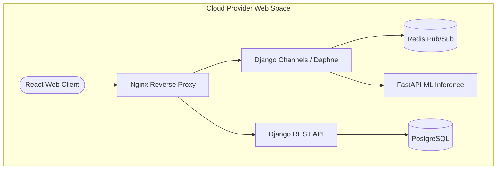
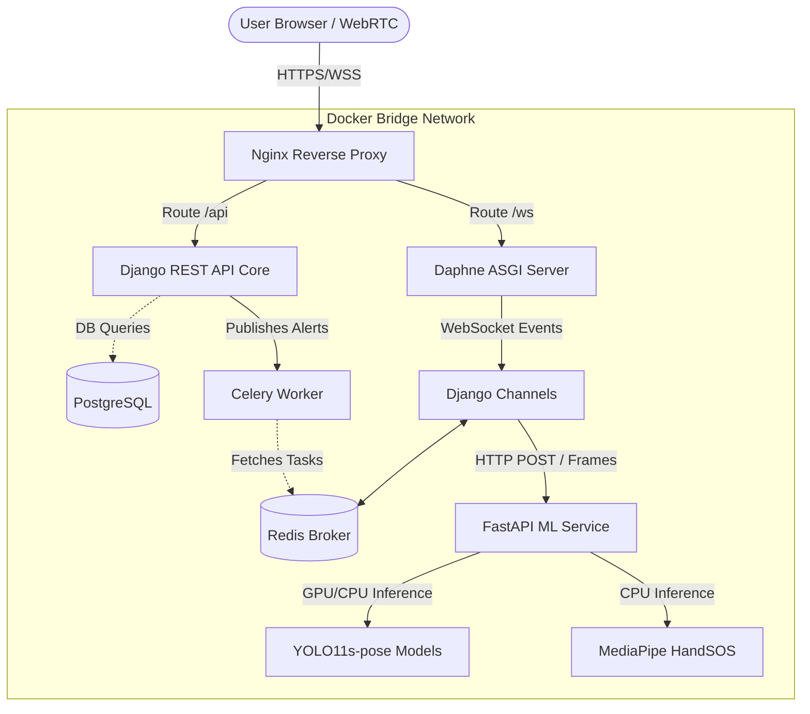
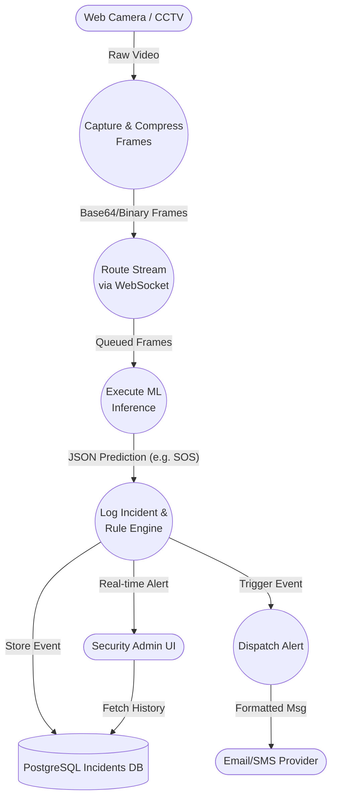
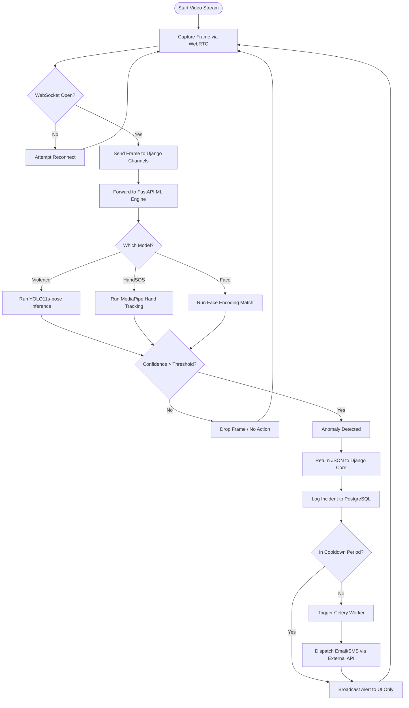

# CareVault: Technical Migration & Architecture Proposal

## 1. Executive Summary
This document provides a detailed technical roadmap and rationale for migrating the CareVault suite (including HandSOS, Violence Detection, Missing Person Identification, and Incident Severity) from its current monolithic, local-hardware-dependent implementation to a modern, scalable, microservice-oriented cloud architecture.

## 2. Analysis of Current Architecture
Currently, individual modules (e.g., `HandSOS`, `ViolenceDetection`) operate as standalone applications, predominantly using Flask.

### 2.1 Current Technical Stack & Patterns
- **Web Framework:** Flask
- **Video Capture:** Direct OpenCV hardware capture (`cv2.VideoCapture(0)`) running on the server.
- **Inference Runtime:** Machine Learning models (Mediapipe, YOLO11s-pose, XGBoost) run synchronously within the web server process.
- **Streaming Protocol:** MJPEG via HTTP `multipart/x-mixed-replace`.
- **Alerting:** Blocking email alerts triggered locally on the main thread.

### 2.2 Shortcomings & Limitations
1. **Hardware Coupling:** Because the system directly queries `cv2.VideoCapture(0)`, the server *must* run on the same physical device as the camera. This completely prevents cloud deployment and distributed usage.
2. **Blocking Operations:** Video processing runs in an infinite loop inside Flask request handlers (e.g., `generate_frames()`). This blocks threads, causing severe bottlenecks for multiple users.
3. **Inefficient Streaming:** MJPEG over HTTP is notoriously bandwidth-heavy and inefficient compared to modern streaming protocols.
4. **Poor Separation of Concerns:** UI rendering, authentication (if any), database connections, and intensive ML inferences are jumbled in a single process.
5. **Horizontal Scalability:** The current app cannot be scaled horizontally. If traffic spikes, ML inference will crash the web server.

---

## 3. Proposed Scalable Architecture
To resolve these bottlenecks, we are moving to a **Microservice-Based Architecture** orchestrated via Docker. This explicitly divides the application into isolated, domain-specific services.

### 3.1 Architecture Components

1. **Frontend Application (React/Browser)**
   - **Role:** Web-based UI for users and administrators.
   - **Tech:** React JS.
   - **Mechanism:** Leverages **WebRTC** to capture camera frames client-side, compressing and sending them over WebSockets.

2. **Core Backend Service (Django & PostgreSQL)**
   - **Role:** Business logic, Authentication, User Dashboard, Admin panel, Incident logging.
   - **Tech:** Django, Django REST Framework (DRF), PostgreSQL.
   - **Mechanism:** Manages state, logs incidents into PostgreSQL, and serves REST APIs for the React frontend.

3. **Real-time Gateway (Django Channels, Daphne, Redis)**
   - **Role:** Handles the persistent bidirection pipeline for video frames and alerts.
   - **Tech:** Django Channels (ASGI), Daphne (ASGI Server), Redis (Channel Layer / Message Broker).
   - **Mechanism:** Receives WebSocket streams from the frontend, acts as a high-throughput pipe directing frames to the ML service, and pushes alerts back to the UI.

4. **Dedicated ML Inference Service (FastAPI)**
   - **Role:** Exclusively handles computer vision models (HandSOS Mediapipe, Violence Detection YOLO, Facial Recognition).
   - **Tech:** FastAPI, OpenCV, PyTorch/TensorFlow.
   - **Mechanism:** Receives frames from the Django WebSocket pipeline, performs inference, and instantly returns the prediction (e.g., "SOS Detected", "Violence Detected") back to Django.

### 3.2 Diagrams

#### 3.2.1 High-Level Architecture Diagram
This diagram shows the structural separation of concerns across the new microservice architecture.

#### 3.2.2 System Diagram
The System Diagram illustrates the physical and logical deployment of containers, highlighting how they communicate over the internal Docker network.

#### 3.2.3 Data Flow Diagram (DFD) -> Level 1
This diagram maps the flow of actual data (video frames, predictions, and alerts) through the system.

#### 3.2.4 Process Flow Chart (Incident Detection)
This flow chart details the logical decision-making process from the moment a frame is captured until an alert is triggered.

### 3.3 New Feature: Multi-Camera Vigilance Dashboard

To support multiple cameras simultaneously on a centralized Vigilance Screen (Violence Detection Dashboard), the architecture is designed to handle parallel streams efficiently:

- **Multiplexed WebSockets:** Each camera feed on the frontend establishes a lightweight WebSocket connection (or a multiplexed single connection) to Django Channels. 
- **Room/Group Channels:** Django Channels utilizes Redis to group camera feeds by location or dashboard view, ensuring that alerts are broadcasted to the correct monitoring screens.
- **Batched ML Inference:** The FastAPI ML Service can be scaled horizontally. When multiple frames arrive simultaneously, FastAPI can batch them into a single tensor for the YOLO model, massively improving GPU utilization and inference speed compared to processing them individually.
- **Grid UI Dashboard:** The React Frontend provides a grid layout where each cell renders a low-latency WebRTC feed of a specific camera, with overlay bounding boxes injected dynamically via the WebSocket JSON response rather than re-rendering the whole video in the backend. This guarantees smooth playback even with 10+ cameras on a single screen.

### 3.4 Tooling & Dependency Management

To guarantee reproducible environments across our microservices, we will adopt **Poetry** for all Python dependency management.
- **Target Microservices:** Django Core API, ASGI Real-time Gateway, and FastAPI ML Engine.
- **Rationale:** Poetry modernizes the Python workflow by providing strict deterministic builds (via `poetry.lock`), separating development and production dependencies intuitively, and eliminating dependency resolution conflicts commonly found with standard `pip` and flat `requirements.txt` ecosystems.

---

## 4. Why Are We Doing This? (Technical Rationale)

### 4.1 Cloud-Readiness & Device Independence
By shifting video capture to the client browser via WebRTC, the server no longer needs physical cameras. CareVault can be hosted on AWS/GCP while users connect from any device (laptop, phone, CCTV router) globally.

### 4.2 Non-Blocking Asynchronous Workloads
Using ASGI (Daphne/Channels) and WebSockets over legacy WSGI (Flask MJPEG) allows non-blocking I/O. Thousands of clients can maintain open WebSockets concurrently without freezing the server.

### 4.3 Fault Isolation & Independent Scaling
Machine learning is computationally expensive. If a surge of users connects, the YOLO/Mediapipe models will consume massive CPU/GPU resources. 
- In the old architecture, this brings down the whole app.
- In the new architecture, we can scale the **FastAPI** ML service horizontally (adding more containers or GPU nodes) while keeping the **Django** Admin service small and cheap.

### 4.4 Security & Separation of Concerns
Email credentials and database admin logic are stripped away from the vulnerable ML processing logic. Background alerting ensures the system never waits for an SMTP server to respond before processing the next frame.

---

## 5. Migration Roadmap

### Phase 1: Foundation (UI & Core Server)
- Spin up a local database environment using official **PostgreSQL and Redis Docker images** via `docker-compose`.
- Initialize the Django project natively. Execute database tasks (e.g., migrations, seeding) against the locally exposed Docker container ports. Use **Poetry** to manage and lock core application dependencies.
- Build the basic React Frontend (replacing static HTML templates).
- Set up JWT Authentication and User models.

### Phase 2: ML Extraction into FastAPI
- Initialize the standalone FastAPI application project using **Poetry**.
- Strip Mediapipe, OpenCV, and YOLO code out of the existing Flask `app.py` files.
- Re-wrap them in FastAPI endpoints that accept `base64` strings or binary image files and return JSON results.

### Phase 3: Real-Time Pipeline Setup
- Configure Redis and Django Channels.
- Implement WebRTC in React for capturing frames at ~10-15 FPS.
- Wire WebSockets to route frames from React -> Django -> FastAPI.

### Phase 4: Event Handling & Alerting
- Implement Celery/Redis for asynchronous email sending.
- Store incident thresholds and trigger criteria in the database.

### Phase 5: Containerization & Deployment
- For local development, **Core API**, **ML Service**, and **Frontend** will run *natively* to bypass complex host-to-container hardware integrations (e.g. camera feeds/GPU passthrough).
- Infrastructure like PostgreSQL and Redis will be orchestrated via `docker-compose.yml`.
- Build complete containerization (writing production `Dockerfile`s) later when moving to a fully remote cloud environment.
